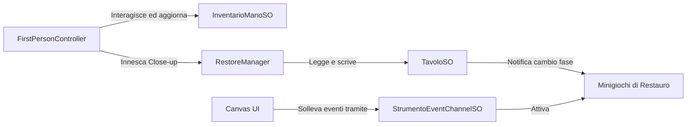

# RestoreIt - Documentazione Tecnica dell'Architettura di Gioco

Benvenuto nel manuale di sviluppo di **RestoreIt**, un'esperienza interattiva tridimensionale sviluppata in Unity incentrata sul restauro archeologico di precisione e sull'esplorazione in prima persona. Questa cartella raccoglie la documentazione strutturata del codice sorgente per consentire ai programmatori di comprendere a fondo il funzionamento interno del progetto.

---

## 🏗️ Architettura del Sistema: Disaccoppiamento e ScriptableObjects

Il design tecnico di **RestoreIt** si basa sul principio della **separazione delle responsabilità** per evitare riferimenti diretti (hard reference) tra i sottosistemi di gioco (Player, Workbench, UI). Questa separazione è garantita dall'utilizzo strategico di **ScriptableObjects**:

1. **Gestione dello Stato Globale**: Lo stato di ciascun banco da lavoro e dell'inventario in mano al giocatore è persistito in ScriptableObject dedicati (`TavoloSO`, `InventarioManoSO`). Questi oggetti fungono da unica fonte di verità (Single Source of Truth), permettendo a qualsiasi script di conoscere lo stato del gioco senza dover interrogare direttamente altri manager.
2. **Architettura ad Eventi (Event Channels)**: La comunicazione inter-sistema avviene tramite canali di eventi basati su ScriptableObject (`VoidEventChannelSO`, `StrumentoEventChannelSO`).
   - *Esempio*: Quando il giocatore preme un pulsante dell'interfaccia utente per selezionare uno strumento, il componente UI solleva un evento su un canale ScriptableObject. Lo script del minigioco (`StrumentoPulizia`) riceve la notifica e si attiva, senza che l'interfaccia conosca lo script di pulizia o viceversa.

---

## 📂 Organizzazione Logica della Documentazione

La documentazione del progetto è suddivisa in **4 macroaree logiche**, ciascuna corredata da una guida di approfondimento sui relativi script e flussi di esecuzione:

### 1. [Restoration Core](file:///C:/Users/migli/Documents/Unity%20Projects/RestoreIt/Assets/readme/macroareas/RestorationCore.md)
*Controlla le inquadrature ravvicinate (Close-up 3D), la macchina a stati del restauro e l'esecuzione dei minigiochi.*
- **Script principali**: [RestoreManager](file:///C:/Users/migli/Documents/Unity%20Projects/RestoreIt/Assets/readme/scripts/RestoreManager.md), [StrumentoPulizia](file:///C:/Users/migli/Documents/Unity%20Projects/RestoreIt/Assets/readme/scripts/StrumentoPulizia.md), [GestoreAssemblaggio](file:///C:/Users/migli/Documents/Unity%20Projects/RestoreIt/Assets/readme/scripts/GestoreAssemblaggio.md), [GestoreIncollaggio](file:///C:/Users/migli/Documents/Unity%20Projects/RestoreIt/Assets/readme/scripts/GestoreIncollaggio.md).

### 2. [Player & World Interaction](file:///C:/Users/migli/Documents/Unity%20Projects/RestoreIt/Assets/readme/macroareas/PlayerInteraction.md)
*Gestisce il movimento del giocatore, il controllo delle pendenze, il raycast per l'interazione con oggetti e piedistalli del museo.*
- **Script principali**: [FirstPersonController](file:///C:/Users/migli/Documents/Unity%20Projects/RestoreIt/Assets/readme/scripts/FirstPersonController.md), [PickUp_Interaction](file:///C:/Users/migli/Documents/Unity%20Projects/RestoreIt/Assets/readme/scripts/PickUp_Interaction.md), [DropZone_Interaction](file:///C:/Users/migli/Documents/Unity%20Projects/RestoreIt/Assets/readme/scripts/DropZone_Interaction.md), [PedestalDropZone](file:///C:/Users/migli/Documents/Unity%20Projects/RestoreIt/Assets/readme/scripts/PedestalDropZone.md).

### 3. [ScriptableObjects & Data Model](file:///C:/Users/migli/Documents/Unity%20Projects/RestoreIt/Assets/readme/macroareas/DataModel.md)
*Rappresenta il modello dati di configurazione dei reperti archeologici, l'avanzamento delle fasi ed i canali per la trasmissione asincrona di eventi.*
- **Script principali**: [TavoloSO](file:///C:/Users/migli/Documents/Unity%20Projects/RestoreIt/Assets/readme/scripts/TavoloSO.md), [InventarioManoSO](file:///C:/Users/migli/Documents/Unity%20Projects/RestoreIt/Assets/readme/scripts/InventarioManoSO.md), [MosaicoSO](file:///C:/Users/migli/Documents/Unity%20Projects/RestoreIt/Assets/readme/scripts/MosaicoSO.md), [VaschettaSO](file:///C:/Users/migli/Documents/Unity%20Projects/RestoreIt/Assets/readme/scripts/VaschettaSO.md).

### 4. [UI & System Utilities](file:///C:/Users/migli/Documents/Unity%20Projects/RestoreIt/Assets/readme/macroareas/UISupport.md)
*Organizza i componenti della UI e i gestori delle schermate di menu.*
- **Script principali**: [BottoneStrumento](file:///C:/Users/migli/Documents/Unity%20Projects/RestoreIt/Assets/readme/scripts/BottoneStrumento.md), [Menu](file:///C:/Users/migli/Documents/Unity%20Projects/RestoreIt/Assets/readme/scripts/Menu.md), [SuggerimentoMano](file:///C:/Users/migli/Documents/Unity%20Projects/RestoreIt/Assets/readme/scripts/SuggerimentoMano.md).

---

## 📈 Tecniche e Calcoli Matematici Chiave

All'interno del codice vengono applicati diversi algoritmi e concetti matematici descritti nel dettaglio all'interno delle macroaree:
1. **Raycast UV e Scansione del Viewport (Pittura)**: Nelle fasi di pulizia e incollaggio, i raggi proiettati dalla telecamera ricavano le coordinate UV normalizzate `(x, y)`. Per evitare che i pixel occlusi o non visibili impediscano il completamento della fase, viene effettuata una griglia di scansione preliminare per calcolare la percentuale solo sui pixel sporchi effettivamente raggiungibili dall'utente.
2. **Compensazione delle Scale Locali (Reparenting)**: Per impedire distorsioni dimensionali dei mesh 3D quando vengono spostati gerarchicamente tra il giocatore e i tavoli, gli script calcolano la nuova scala locale dividendo la scala globale originale per la scala globale del nuovo parent.
3. **Calcolo della Fisica del Movimento e Scivolamento**: Il controller calcola la direzione di scivolamento sulle superfici inclinate proiettando il vettore di gravità sulla normale del piano inclinato tramite il prodotto vettoriale (Cross Product).

---

## 📂 Indice Analitico di Dettaglio degli Script

Se cerchi informazioni specifiche su un singolo file, consulta la tabella sottostante per accedere alla relativa documentazione approfondita:

| Script | Descrizione Tecnica |
| :--- | :--- |
| **[FirstPersonController](file:///C:/Users/migli/Documents/Unity%20Projects/RestoreIt/Assets/readme/scripts/FirstPersonController.md)** | Gestione del movimento FPS, camera look, scivolamento su pendenze e raycast di interazione. |
| **[PickUp_Interaction](file:///C:/Users/migli/Documents/Unity%20Projects/RestoreIt/Assets/readme/scripts/PickUp_Interaction.md)** | Consente la raccolta fisica del reperto e calcola la compensazione di scala locale. |
| **[DropZone_Interaction](file:///C:/Users/migli/Documents/Unity%20Projects/RestoreIt/Assets/readme/scripts/DropZone_Interaction.md)** | Gestisce il posizionamento dei reperti sul workbench ed il disaccoppiamento della mano. |
| **[PedestalDropZone](file:///C:/Users/migli/Documents/Unity%20Projects/RestoreIt/Assets/readme/scripts/PedestalDropZone.md)** | Consente l'esposizione del reperto restaurato sul piedistallo espositivo del museo con distinzione per tipo (anfore o mosaici). |
| **[RestoreManager](file:///C:/Users/migli/Documents/Unity%20Projects/RestoreIt/Assets/readme/scripts/RestoreManager.md)** | Coordinatore delle fasi di restauro, lerp telecamera e switch dei minigiochi attivi. |
| **[StrumentoPulizia](file:///C:/Users/migli/Documents/Unity%20Projects/RestoreIt/Assets/readme/scripts/StrumentoPulizia.md)** | Minigioco di pulizia del fango basato su viewport scanning e pittura su texture a runtime. |
| **[GestoreAssemblaggio](file:///C:/Users/migli/Documents/Unity%20Projects/RestoreIt/Assets/readme/scripts/GestoreAssemblaggio.md)** | Minigioco di puzzle 3D basato su piani di drag orientati alla camera e tolleranze di snap. |
| **[GestoreIncollaggio](file:///C:/Users/migli/Documents/Unity%20Projects/RestoreIt/Assets/readme/scripts/GestoreIncollaggio.md)** | Pittura UV della colla lungo le linee di crepa dell'anfora guidata da maschera. |
| **[GestoreIncollaggioMosaico](file:///C:/Users/migli/Documents/Unity%20Projects/RestoreIt/Assets/readme/scripts/GestoreIncollaggioMosaico.md)** | Stesura di resina/colla su mosaico con scansione di visibilità e pittura a runtime. |
| **[GestoreGarze](file:///C:/Users/migli/Documents/Unity%20Projects/RestoreIt/Assets/readme/scripts/GestoreGarze.md)** | Istanziazione, trascinamento spaziale e allineamento guidato delle garze sul mosaico. |
| **[GestoreRimozioneGarza](file:///C:/Users/migli/Documents/Unity%20Projects/RestoreIt/Assets/readme/scripts/GestoreRimozioneGarza.md)** | Rilevamento click su collider dinamico per distruggere la garza a fine restauro. |
| **[GestoreRotazioneMosaico](file:///C:/Users/migli/Documents/Unity%20Projects/RestoreIt/Assets/readme/scripts/GestoreRotazioneMosaico.md)** | Slerp automatico di rotazione di 180° per mostrare il retro o il fronte del mosaico. |
| **[GestoreEsposizione](file:///C:/Users/migli/Documents/Unity%20Projects/RestoreIt/Assets/readme/scripts/GestoreEsposizione.md)** | Rileva lo stato di tutti i piedistalli museali per decretare il completamento del livello. |
| **[GestoreFrecceRestauro](file:///C:/Users/migli/Documents/Unity%20Projects/RestoreIt/Assets/readme/scripts/GestoreFrecceRestauro.md)** | Movimento oscillatorio sinusoidale ed effetto billboard (LookAt Player) delle frecce 3D. |
| **[TavoloSO](file:///C:/Users/migli/Documents/Unity%20Projects/RestoreIt/Assets/readme/scripts/TavoloSO.md)** | ScriptableObject che modella e persiste lo stato runtime di ciascun workbench. |
| **[InventarioManoSO](file:///C:/Users/migli/Documents/Unity%20Projects/RestoreIt/Assets/readme/scripts/InventarioManoSO.md)** | ScriptableObject per lo stato della mano del giocatore con evento `OnInventarioAggiornato` per notifiche reattive. |
| **[SuggerimentoMano](file:///C:/Users/migli/Documents/Unity%20Projects/RestoreIt/Assets/readme/scripts/SuggerimentoMano.md)** | Componente UI che mostra suggerimenti contestuali reagendo all'evento dell'inventario, senza polling in Update. |
