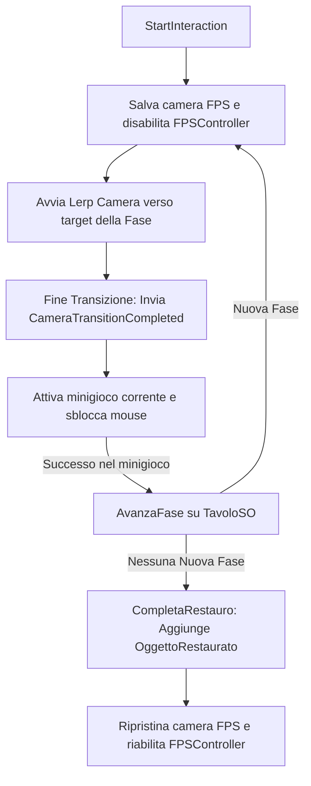

# Macroarea: Restoration Core (Sistema di Restauro Principale)

Questa macroarea racchiude i sistemi, gli algoritmi e i minigiochi che si attivano quando il giocatore interagisce con un tavolo da lavoro (Workbench). Il sistema disabilita il movimento in prima persona ed entra in una visuale ravvicinata (Close-up 3D) per consentire all'utente di lavorare direttamente sul reperto archeologico.

---

## 🛠️ Gli Script della Macroarea

La logica del restauro è modularizzata nei seguenti script:
1. **[RestoreManager](file:///C:/Users/migli/Documents/Unity%20Projects/RestoreIt/Assets/readme/scripts/RestoreManager.md)**: Il cervello della postazione. Gestisce la telecamera principale, disabilita il giocatore, e attiva sequenzialmente i singoli minigiochi in base alle fasi.
2. **[StrumentoPulizia](file:///C:/Users/migli/Documents/Unity%20Projects/RestoreIt/Assets/readme/scripts/StrumentoPulizia.md)**: Gestisce il minigioco di rimozione della terra/fango depositati sui reperti tramite pittura UV dinamica.
3. **[GestoreAssemblaggio](file:///C:/Users/migli/Documents/Unity%20Projects/RestoreIt/Assets/readme/scripts/GestoreAssemblaggio.md)**: Gestisce il minigioco di puzzle 3D per ricomporre l'anfora a partire dai frammenti sparsi nella vaschetta.
4. **[GestoreIncollaggio](file:///C:/Users/migli/Documents/Unity%20Projects/RestoreIt/Assets/readme/scripts/GestoreIncollaggio.md)**: Gestisce l'applicazione di colla sulle linee di crepa dell'anfora assemblata tramite pittura UV guidata da una maschera.
5. **[GestoreIncollaggioMosaico](file:///C:/Users/migli/Documents/Unity%20Projects/RestoreIt/Assets/readme/scripts/GestoreIncollaggioMosaico.md)**: Speculare a `GestoreIncollaggio`, adibito alla posa di colla o resina consolidante sulle tessere del mosaico.
6. **[GestoreGarze](file:///C:/Users/migli/Documents/Unity%20Projects/RestoreIt/Assets/readme/scripts/GestoreGarze.md)**: Gestisce il prelievo, il drag & drop e lo snap di garze o pannelli di Aerolam sul mosaico per consolidarne la struttura.
7. **[GestoreRimozioneGarza](file:///C:/Users/migli/Documents/Unity%20Projects/RestoreIt/Assets/readme/scripts/GestoreRimozioneGarza.md)**: Rileva il click dell'utente per distruggere la garza protettiva a fine restauro e mostrare il mosaico finito.
8. **[GestoreRotazioneMosaico](file:///C:/Users/migli/Documents/Unity%20Projects/RestoreIt/Assets/readme/scripts/GestoreRotazioneMosaico.md)**: Ruota automaticamente di 180° la tavola del mosaico (flip fronte/retro) per consentire le lavorazioni su entrambi i lati.

---

## 🔄 Ciclo dei Flussi e Macchina a Stati

Il ciclo di restauro è gestito da `RestoreManager` come una macchina a stati sequenziale guidata dal file `TavoloSO`.

### 1. Inizio Sessione
Quando il giocatore preme il tasto di interazione davanti a un tavolo contenente un reperto non restaurato, il `RestoreManager` salva la posizione della telecamera del giocatore, disabilita lo script `FirstPersonController`, sblocca il cursore del mouse e avvia un movimento fluido (lerp lineare) della telecamera verso la posizione e la rotazione di close-up assegnate alla fase corrente.

### 2. Transizione Telecamera
Per evitare che il giocatore agisca sul reperto mentre la telecamera è in movimento, l'input del minigioco è bloccato fino a quando la telecamera non raggiunge la destinazione. Una volta arrivata, `RestoreManager` invoca il metodo `CameraTransitionCompleted()` sul componente attivo, che sblocca il controllo e imposta il cursore del mouse appropriato (es. icona di pennello, colla, o drag).

### 3. Cambio Fase
Ogni minigioco, al raggiungimento dell'obiettivo, invoca `tavoloCorrente.AvanzaFase(faseSuccessiva)`. L'evento `OnFaseCambiata` notifica il `RestoreManager` che disattiva il GameObject della fase precedente, attiva il GameObject della fase successiva, e avvia una nuova transizione di camera verso la nuova inquadratura.

---

## 🎨 Logica e Algoritmi di Pittura UV su Texture (Pulizia e Incollaggio)

La pulizia della terra (`StrumentoPulizia`) e la stesura della colla (`GestoreIncollaggio` e `GestoreIncollaggioMosaico`) si basano su un algoritmo di pittura di precisione a runtime su texture 2D.

### 1. Il Raycast UV
Ogni volta che l'utente clicca o trascina il cursore sopra il modello 3D, viene sparato un raggio dalla telecamera di restauro. Poiché il modello possiede un `MeshCollider`, Unity restituisce le coordinate UV nel punto di collisione (`hit.textureCoord`). Le coordinate UV indicano la posizione normalizzata (valori tra `0` e `1`) sulla superficie 2D che avvolge il modello 3D.
Le coordinate vengono convertite in coordinate pixel reali moltiplicandole per la risoluzione della texture (`textureRes` o `width`/`height` della maschera):
$$\text{pixelX} = \text{uv.x} \times \text{width}$$
$$\text{pixelY} = \text{uv.y} \times \text{height}$$

### 2. Algoritmo di Viewport Scanning (Prevenzione Soft-lock)
Le anfore e i mosaici presentano aree della texture che non sono visibili (perché occluse, rivolte sul retro o nascoste da altri elementi geometrici). Se calcolassimo i progressi basandoci sull'intera texture, il giocatore non potrebbe mai completare il restauro poiché non potrebbe dipingere le parti invisibili.
Per ovviare a questo, all'avvio della fase viene invocato `CountVisiblePixel()`, che esegue un **Viewport Scanning**:
- Genera una griglia virtuale (es. 512x512) di raggi proiettati dal viewport della telecamera di restauro.
- Calcola tutte le collisioni con l'oggetto 3D e ne ricava le coordinate UV visibili.
- Segna tali pixel come "raggiungibili" in un array di booleani temporaneo (`pixelRaggiungibili`).
- Il totale dei pixel richiesti per il completamento (`totPixel`) viene calcolato sommando solo i pixel che contengono sporco (o colla) nella maschera originaria **E** che sono stati marcati come raggiungibili.

### 3. Pittura dei Pixel
Durante il drag, lo script scorre tutti i pixel compresi nel raggio del pennello (`rangePaintbrush` o `rangePennelloColla`) centrato su `(pixelCentroX, pixelCentroY)`. Per ogni pixel che rientra nel cerchio (verificato tramite equazione del cerchio: $dx^2 + dy^2 \le raggio^2$):
- In **Pulizia**, viene sovrascritto un colore nero opaco per azzerare lo sporco, e viene incrementato il contatore dei pixel puliti (`pixelPainted`).
- In **Incollaggio**, viene scritto un colore bianco opaco per indicare la stesura della colla, incrementando `pixelCollaDipinti`.
La percentuale di avanzamento viene calcolata come:
$$\text{Progresso} = \frac{\text{pixel dipinti}}{\text{totale pixel visibili necessari}}$$

---

## 🧩 Logiche di Drag & Snap (Assemblaggio e Garze)

Le fasi di assemblaggio e di applicazione delle garze richiedono al giocatore di prendere un pezzo fisico e posizionarlo nella giusta collocazione spaziale sul reperto.

### 1. Il Piano di Drag Virtuale (Camera-Aligned Plane)
Quando l'utente clicca su un pezzo tridimensionale, lo script deve spostarlo seguendo i movimenti del mouse nel mondo 3D. Per farlo in modo preciso ed evitare che l'oggetto fluttui all'infinito o compenetri altri collider, lo script:
1. Calcola la profondità spaziale ($Z$) del punto di snap finale rispetto alla camera tramite prodotto scalare (Dot Product) tra il vettore distanza e la direzione frontale della telecamera.
2. Definisce un **piano virtuale infinito** (`Plane`) parallelo alla telecamera e passante per quel punto a profondità $Z$.
3. Ad ogni frame, proietta un raggio dal cursore del mouse sul piano virtuale e sposta l'oggetto sul punto di intersezione ricavato (`dragPlane.Raycast`).

### 2. Le Tolleranze di Snap (Distanza ed Angolo)
Durante il trascinamento, lo script confronta costantemente la posizione e l'orientamento correnti dell'oggetto con la posizione e la rotazione target finali. Lo snap automatico si attiva se vengono soddisfatte contemporaneamente due condizioni:
- **Distanza spaziale** minore della soglia configurata:
  $$\text{Vector3.Distance(transform.position, targetPosition)} \le \text{snapDistance}$$
- **Distanza angolare** minore della soglia configurata:
  $$\text{Quaternion.Angle(transform.rotation, targetRotation)} \le \text{snapAngle}$$

Una volta attivato lo snap, l'oggetto viene riparentato sotto il reperto principale, la sua trasformazione locale viene impostata esattamente sui valori di default (azzerando eventuali scarti) e i suoi collider vengono disabilitati per impedirne un nuovo trascinamento.
