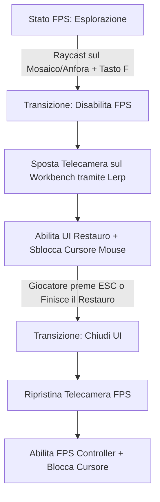
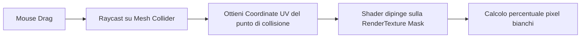
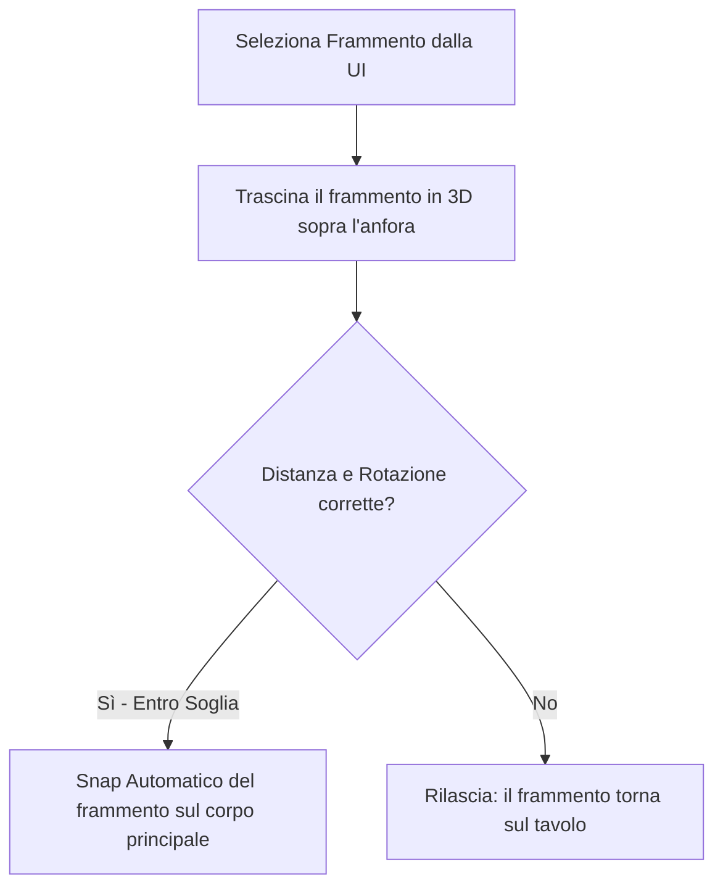

# Guida allo Sviluppo: Sistema di Restauro (Mosaico & Anfora)

Questa guida illustra l'architettura tecnica e i dettagli implementativi per lo sviluppo del gioco di restauro in Unity. Copre la struttura comune, le fasi specifiche del **Mosaico** e le fasi specifiche dell'**Anfora**.

---

## 🛠️ 1. Architettura Comune: Il Sistema di Interazione e Close-Up

Per entrambi gli oggetti, l'interazione passa da una visuale in prima persona (esplorativa) a una **visuale ravvicinata (Close-up 3D)** per il restauro.

### Diagramma di Flusso delle Transizioni



### Script di Gestione: `RestorationInteraction.cs`
Questo script va posizionato sull'oggetto interattivo (Mosaico o Anfora) nella scena 3D.

```csharp
using UnityEngine;

public class RestorationInteraction : MonoBehaviour
{
    [Header("Inquadratura")]
    [SerializeField] private Transform targetCameraSeat; // Posizione telecamera durante il restauro
    [SerializeField] private float transitionDuration = 1.5f;

    [Header("UI & Controller")]
    [SerializeField] private GameObject restorationCanvas;
    [SerializeField] private MonoBehaviour fpsControllerScript; // Riferimento al FirstPersonController.cs
    
    private Camera mainCamera;
    private Vector3 originalCamPosition;
    private Quaternion originalCamRotation;
    private bool isInRestoration = false;

    private void Start()
    {
        mainCamera = Camera.main;
        restorationCanvas.SetActive(false);
    }

    private void Update()
    {
        if (isInRestoration && Input.GetKeyDown(KeyCode.Escape))
        {
            ExitRestoration();
        }
    }

    public void EnterRestoration()
    {
        isInRestoration = true;
        
        // 1. Salva posizioni originali
        originalCamPosition = mainCamera.transform.position;
        originalCamRotation = mainCamera.transform.rotation;

        // 2. Disabilita movimento del giocatore
        fpsControllerScript.enabled = false;
        Cursor.lockState = CursorLockMode.None;
        Cursor.visible = true;

        // 3. Avvia spostamento telecamera (Lerp)
        StartCoroutine(MoveCamera(targetCameraSeat.position, targetCameraSeat.rotation, () => {
            // Abilita la UI alla fine del movimento
            restorationCanvas.SetActive(true);
            // Avvia la macchina a stati del restauro specifico
            GetComponent<IRestorationController>()?.StartRestoration();
        }));
    }

    public void ExitRestoration()
    {
        restorationCanvas.SetActive(false);
        GetComponent<IRestorationController>()?.PauseOrStopRestoration();

        StartCoroutine(MoveCamera(originalCamPosition, originalCamRotation, () => {
            fpsControllerScript.enabled = true;
            Cursor.lockState = CursorLockMode.Locked;
            Cursor.visible = false;
            isInRestoration = false;
        }));
    }

    private System.Collections.IEnumerator MoveCamera(Vector3 targetPos, Quaternion targetRot, System.Action onComplete)
    {
        float elapsed = 0f;
        Vector3 startPos = mainCamera.transform.position;
        Quaternion startRot = mainCamera.transform.rotation;

        while (elapsed < transitionDuration)
        {
            elapsed += Time.deltaTime;
            float t = Mathf.SmoothStep(0f, 1f, elapsed / transitionDuration);
            mainCamera.transform.position = Vector3.Lerp(startPos, targetPos, t);
            mainCamera.transform.rotation = Quaternion.Slerp(startRot, targetRot, t);
            yield return null;
        }

        mainCamera.transform.position = targetPos;
        mainCamera.transform.rotation = targetRot;
        onComplete?.Invoke();
    }
}

public interface IRestorationController
{
    void StartRestoration();
    void PauseOrStopRestoration();
}
```

---

## 🎨 2. Sviluppo del Mosaico (9 Fasi)

### Il Cuore Tecnologico: UV Painting tramite RenderTexture
Per le fasi con percentuale di completamento (1, 2, 4, 5, 8, 9), si usa un sistema che scrive su una texture.



#### Shader per la Maschera di Pittura (`MosaicPaint.shader`)
Crea un materiale per il mosaico. Lo shader usa le coordinate UV per unire la texture originale al "colore del restauro" (es. sporco che sparisce o colla che si stende) basandosi su una texture dinamica `_PaintMask`.

```shader
Shader "Custom/MosaicPaint"
{
    Properties
    {
        _MainTex ("Base Texture (Mosaico)", 2D) = "white" {}
        _PaintMask ("Paint Mask (RenderTexture)", 2D) = "black" {}
        _OverlayColor ("Colore Finitura (Sporco/Colla)", Color) = (0.5, 0.5, 0.5, 1)
        _IsCleaningPhase ("1 = Pulisci (Rivela), 0 = Copri (Applica)", Float) = 1
    }
    SubShader
    {
        Tags { "RenderType"="Opaque" }
        LOD 100

        Pass
        {
            CGPROGRAM
            #pragma vertex vert
            #pragma fragment frag
            #include "UnityCG.cginc"

            struct appdata
            {
                float4 vertex : POSITION;
                float2 uv : TEXCOORD0;
            };

            struct v2f
            {
                float2 uv : TEXCOORD0;
                float4 vertex : SV_POSITION;
            };

            sampler2D _MainTex;
            sampler2D _PaintMask;
            float4 _OverlayColor;
            float _IsCleaningPhase;

            v2f vert (appdata v)
            {
                v2f o;
                o.vertex = UnityObjectToClipPos(v.vertex);
                o.uv = v.uv;
                return o;
            }

            fixed4 frag (v2f i) : SV_Target
            {
                fixed4 base = tex2D(_MainTex, i.uv);
                fixed4 mask = tex2D(_PaintMask, i.uv);
                
                // mask.r indica quanto è stato dipinto (0 = nero, 1 = bianco)
                float t = mask.r;
                
                if (_IsCleaningPhase > 0.5)
                {
                    // Rimuove lo sporco: dove c'è pittura (t=1), mostra la base pulita
                    return lerp(_OverlayColor, base, t);
                }
                else
                {
                    // Applica materiale (es. colla): dove c'è pittura, mostra la colla
                    return lerp(base, _OverlayColor, t);
                }
            }
            ENDCG
        }
    }
}
```

#### Script di Pittura: `BrushPainter.cs`
Questo script gestisce il disegno sulla `RenderTexture` legata alla maschera del materiale.

```csharp
using UnityEngine;

public class BrushPainter : MonoBehaviour
{
    [SerializeField] private Material targetMaterial;
    [SerializeField] private int textureSize = 512;
    [SerializeField] private Shader drawShader;
    [SerializeField] private float brushSize = 0.05f;
    [SerializeField] private float brushStrength = 1.0f;

    private RenderTexture paintMask;
    private Material drawMaterial;
    private Camera mainCam;

    void Start()
    {
        mainCam = Camera.main;
        
        // Inizializza la RenderTexture
        paintMask = new RenderTexture(textureSize, textureSize, 0, RenderTextureFormat.R8);
        paintMask.Create();
        
        // Pulisce la texture (tutta nera)
        RenderTexture.active = paintMask;
        GL.Clear(true, true, Color.black);
        RenderTexture.active = null;

        // Assegna la mask al materiale del Mosaico
        targetMaterial.SetTexture("_PaintMask", paintMask);

        // Crea il materiale per disegnare sulla RenderTexture
        drawMaterial = new Material(drawShader);
    }

    public void PaintAtUV(Vector2 uv)
    {
        drawMaterial.SetVector("_BrushCoords", new Vector4(uv.x, uv.y, 0, 0));
        drawMaterial.SetFloat("_BrushSize", brushSize);
        drawMaterial.SetFloat("_BrushStrength", brushStrength);

        RenderTexture temp = RenderTexture.GetTemporary(paintMask.width, paintMask.height, 0, paintMask.format);
        Graphics.Blit(paintMask, temp);
        Graphics.Blit(temp, paintMask, drawMaterial);
        RenderTexture.ReleaseTemporary(temp);
    }

    // Ritorna la percentuale di completamento leggendo i pixel (può essere ottimizzato via Compute Shader o AsyncGPUReadback)
    public float GetProgress()
    {
        Texture2D tex = new Texture2D(paintMask.width, paintMask.height, TextureFormat.R8, false);
        RenderTexture.active = paintMask;
        tex.ReadPixels(new Rect(0, 0, paintMask.width, paintMask.height), 0, 0);
        tex.Apply();
        RenderTexture.active = null;

        Color32[] pixels = tex.GetPixels32();
        int filled = 0;
        for (int i = 0; i < pixels.Length; i++)
        {
            if (pixels[i].r > 200) filled++; // Pixel considerati "dipinti"
        }
        
        Destroy(tex);
        return (float)filled / pixels.Length;
    }
}
```

#### 🌟 Polishing Visivo: Particle Effects per la Pulizia
Per evitare un effetto visivo "piatto" legato alla sola modifica della texture, si unisce il raycast di pittura ad un'emissione dinamica di particelle (polvere, scaglie di terra, spruzzi di solvente).

Lo script rileva la collisione, sposta il `ParticleSystem` in quel punto, lo orienta lungo la normale della mesh (in modo che la polvere schizzi all'infuori) ed emette un getto continuo durante il trascinamento.

##### [NEW] `CleanPainterWithParticles.cs`
```csharp
using UnityEngine;

public class CleanPainterWithParticles : MonoBehaviour
{
    [Header("Pittura Texture")]
    [SerializeField] private BrushPainter brushPainter;
    [SerializeField] private LayerMask paintLayerMask;

    [Header("Effetti Particellari")]
    [SerializeField] private ParticleSystem dustParticles; // Prefab o istanza in scena
    [SerializeField] private int particlesPerFrame = 5;

    private Camera mainCam;
    private bool isPainting = false;

    void Start()
    {
        mainCam = Camera.main;
        if (dustParticles != null)
        {
            var emission = dustParticles.emission;
            emission.enabled = false; // Disabilita l'emissione automatica nel tempo
        }
    }

    void Update()
    {
        // Rileva click/drag del mouse
        if (Input.GetMouseButtonDown(0))
        {
            isPainting = true;
        }
        if (Input.GetMouseButtonUp(0))
        {
            isPainting = false;
            if (dustParticles != null) dustParticles.Stop();
        }

        if (isPainting)
        {
            PerformPaintAndParticles();
        }
    }

    private void PerformPaintAndParticles()
    {
        Ray ray = mainCam.ScreenPointToRay(Input.mousePosition);
        if (Physics.Raycast(ray, out RaycastHit hit, 100f, paintLayerMask))
        {
            // 1. Esegui la pittura sulla RenderTexture tramite UV
            if (hit.textureCoord != null)
            {
                brushPainter.PaintAtUV(hit.textureCoord);
            }

            // 2. Gestione particelle
            if (dustParticles != null)
            {
                // Sposta l'emettitore sul punto esatto di contatto
                dustParticles.transform.position = hit.point;
                // Orienta l'emettitore lungo la normale (particelle espulse all'infuori)
                dustParticles.transform.rotation = Quaternion.LookRotation(hit.normal);

                if (!dustParticles.isPlaying)
                {
                    dustParticles.Play();
                }

                // Emette particelle manualmente nel punto colpito
                dustParticles.Emit(particlesPerFrame);
            }
        }
        else
        {
            if (dustParticles != null && dustParticles.isPlaying)
            {
                dustParticles.Stop();
            }
        }
    }
}
```

---

## 🏺 3. Sviluppo dell'Anfora (5 Fasi)

Ecco la guida passo-passo per implementare le fases dell'anfora.

### Fase 3.1: Raccolta e Selezione Frammenti
Il giocatore cerca e raccoglie i cocci dell'anfora sparsi nella stanza. 

#### Implementazione:
1. **Oggetti fisici nella stanza**: Ogni frammento ha un `AmphoraFragment` script con un ID unico e un collider.
2. **Puzzle Visivo / Inventario**: Quando il giocatore clicca su un coccio, si apre un mini panel UI in cui deve decidere se il pezzo appartiene all'anfora in base alle decorazioni e al materiale (confrontandolo con una foto di riferimento).

```csharp
public class AmphoraFragment : MonoBehaviour
{
    public int fragmentID;
    public string fragmentName;
    public Sprite visualPreview; // Usata per la UI
    public bool isCorrectFragment; // Se appartiene davvero all'anfora o è scarto
}
```

---

### Fase 3.2: Ricostruzione (3D Jigsaw Puzzle)
Nel workbench, il corpo principale dell'anfora ha dei "punti di aggancio" (Socket). L'utente deve prendere un pezzo raccolto e trascinarlo vicino alla posizione corretta.



#### Script di Allineamento Frammenti: `FragmentSnapping.cs`
```csharp
using UnityEngine;

public class FragmentSnapping : MonoBehaviour
{
    [SerializeField] private Transform targetSocket; // Il punto esatto dell'anfora in cui deve allinearsi
    [SerializeField] private float snapDistanceThreshold = 0.15f; // 15 cm
    [SerializeField] private float snapRotationThreshold = 20f;   // 20 gradi

    private bool isSnapped = false;
    private Camera cam;

    void Start()
    {
        cam = Camera.main;
    }

    void OnMouseDrag()
    {
        if (isSnapped) return;

        // Semplice drag-and-drop 3D proiettando il mouse sul piano di lavoro
        Vector3 mousePos = Input.mousePosition;
        mousePos.z = cam.WorldToScreenPoint(transform.position).z;
        Vector3 newWorldPos = cam.ScreenToWorldPoint(mousePos);
        transform.position = newWorldPos;

        // Permetti la rotazione del pezzo con la rotella del mouse durante il drag
        float scroll = Input.GetAxis("Mouse ScrollWheel");
        transform.Rotate(Vector3.up, scroll * 150f, Space.World);

        CheckForSnap();
    }

    private void CheckForSnap()
    {
        float distance = Vector3.Distance(transform.position, targetSocket.position);
        float angle = Quaternion.Angle(transform.rotation, targetSocket.rotation);

        if (distance < snapDistanceThreshold && angle < snapRotationThreshold)
        {
            SnapToTarget();
        }
    }

    private void SnapToTarget()
    {
        isSnapped = true;
        transform.position = targetSocket.position;
        transform.rotation = targetSocket.rotation;
        
        // Rende il pezzo figlio dell'anfora principale
        transform.SetParent(targetSocket.parent);
        
        // Notifica il manager che questo pezzo è stato posizionato
        FindObjectOfType<AmphoraController>()?.OnPiecePlaced();
        
        // Disattiva il collider del pezzo per evitare altri trascinamenti
        GetComponent<Collider>().enabled = false;
    }
}
```

---

### Fase 3.3: Consolidamento delle Crepe
L'utente deve applicare una colla/resina lungo le crepe. Per gameplay, si implementa un sistema di **Tracciamento Lineare (Path Tracing)**.

#### Implementazione:
1. Posizionare dei piccoli nodi invisibili (Waypoints) lungo le crepe dell'anfora 3D.
2. Il giocatore deve cliccare sul primo nodo e muovere il cursore seguendo i nodi successivi nell'ordine corretto.
3. Si usa un `LineRenderer` per far vedere la colla stesa.

```csharp
using UnityEngine;
using System.Collections.Generic;

public class CrackConsolidator : MonoBehaviour
{
    [SerializeField] private List<Transform> waypoints; // I nodi della crepa
    [SerializeField] private LineRenderer glueLineRenderer;
    [SerializeField] private float reachThreshold = 0.05f;

    private int currentWaypointIndex = 0;
    private List<Vector3> drawnPoints = new List<Vector3>();

    void Start()
    {
        glueLineRenderer.positionCount = 0;
    }

    void Update()
    {
        if (Input.GetMouseButton(0)) // Click sinistro tenuto premuto
        {
            Ray ray = Camera.main.ScreenPointToRay(Input.mousePosition);
            if (Physics.Raycast(ray, out RaycastHit hit))
            {
                // Controlla se siamo vicini al waypoint corrente
                Transform targetPoint = waypoints[currentWaypointIndex];
                float dist = Vector3.Distance(hit.point, targetPoint.position);

                if (dist < reachThreshold)
                {
                    // Aggiungi il punto visivo
                    drawnPoints.Add(targetPoint.position);
                    glueLineRenderer.positionCount = drawnPoints.Count;
                    glueLineRenderer.SetPosition(drawnPoints.Count - 1, targetPoint.position);

                    currentWaypointIndex++;

                    if (currentWaypointIndex >= waypoints.Count)
                    {
                        OnCrackCompleted();
                    }
                }
            }
        }
    }

    private void OnCrackCompleted()
    {
        Debug.Log("Crepa consolidata!");
        // Notifica al manager
    }
}
```

---

### Fase 3.4: Finitura e Catalogazione
Questa fase è basata sulla UI e simula la documentazione storica dell'opera.

#### Implementazione:
1. **Fotografia**: Una telecamera virtuale inquadra l'anfora ricostruita. Premendo un tasto UI ("Scatta Foto"), viene salvata una `Texture2D` del pezzo restaurato che viene posizionata sulla "scheda di catalogazione".
2. **Scheda Storica**: La UI mostra un form compilabile con:
   - **Periodo**: Menu a tendina (es. Romano, Greco, Bizantino)
   - **Provenienza**: Menu a tendina (es. Basilica di Aquileia, Scavi Archeologici)
   - **Data di Restauro**: Input di testo o data odierna.
3. **Punteggio/Feedback**: Se il giocatore compila correttamente la scheda basandosi sugli indizi visivi (es. simboli romani dipinti sul frammento), riceve un punteggio bonus o sblocca la scheda descrittiva nel museo.

---

### Fase 3.5: Esposizione Finale
Il pezzo viene posizionato definitivamente nel tempio/basilica.

#### Implementazione:
1. Nella scena principale (esplorativa), c'è un piedistallo vuoto nell'atrio con un'etichetta.
2. Al termine del restauro, il file di salvataggio (o il `GameManager`) imposta `amphoraExhibited = true`.
3. Al ritorno nella visuale FPS, l'anfora 3D restaurata viene attivata sul piedistallo, e i visitatori del tempio possono avvicinarsi per leggere la scheda di catalogazione compilata dal giocatore.

---

## 📈 Roadmap di Sviluppo Consigliata

1. **Sprint 1 (Fondazione)**:
   - Setup del Close-up System (transizioni telecamera).
   - Setup della struttura delle cartelle sotto `Assets/IvanMigliore/Scripts/Mosaic`.

2. **Sprint 2 (Pittura & Mosaico)**:
   - Implementazione del `BrushPainter` e dello shader `MosaicPaint`.
   - Setup delle prime fasi del Mosaico.

3. **Sprint 3 (Snapping & Crepe Anfora)**:
   - Creazione del prototipo del puzzle 3D (aggancio dei cocci).
   - Implementazione del tracciamento delle crepe.

4. **Sprint 4 (Catalogazione & Finitura)**:
   - Sviluppo della UI per il form di catalogazione e salvataggio foto.
   - Attivazione dell'anfora nell'atrio della basilica al rientro in FPS.
