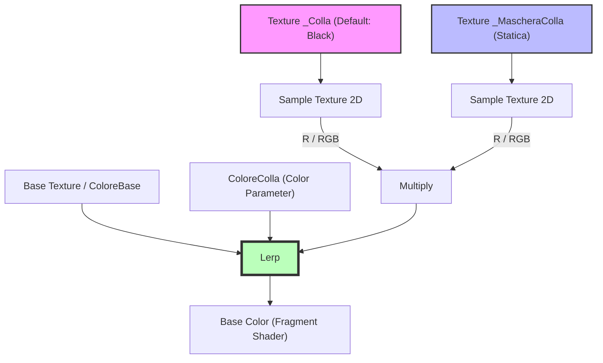

# Soluzione per il Sistema di Restauro (RenderTexture e Shader Graph)

Questo documento analizza la causa per cui l'anfora diventa temporaneamente bianca durante la pulizia dei materiali e fornisce le soluzioni sia lato C# che lato Shader Graph.

---

## 1. Analisi del Problema C# (La causa del colore bianco)

Nel codice originale, la rimozione del secondo materiale (outline) veniva eseguita in questo modo:

```csharp
Renderer r = p.gameObject.GetComponent<Renderer>();
if (r != null && r.materials.Length > 1)
{
    r.materials = new Material[] { r.materials[0] };
}
```

### Perché causava la perdita della texture?
In Unity, la proprietà `Renderer.materials` è un getter che ad ogni chiamata **crea una nuova copia dell'array** e **istanzia nuovamente i materiali** associati. 
1. `r.materials.Length` interroga la proprietà una prima volta.
2. `r.materials[0]` interroga la proprietà una **seconda volta**, forzando Unity a creare una nuova istanza del materiale dal materiale condiviso originale. 
Questo processo di seconda istanziazione fa perdere i parametri impostati a runtime (come la texture/RenderTexture `_Colla` assegnata precedentemente), ripristinando i valori di default dello shader (che tipicamente per le texture è il bianco).

### Soluzione applicata:
Abbiamo modificato [GestoreAssemblaggio.cs](file:///c:/Users/migli/Documents/Unity%20Projects/RestoreIt/Assets/Scripts/GestoreAssemblaggio.cs#L909-L920) per accedere alla proprietà una sola volta tramite una variabile locale:

```csharp
Renderer r = p.gameObject.GetComponent<Renderer>();
if (r != null)
{
    Material[] mats = r.materials; // Chiamata al getter singola (istanziazione singola)
    if (mats.Length > 1)
    {
        r.materials = new Material[] { mats[0] }; // Riutilizza l'istanza corretta che ha già _Colla impostata
    }
}
```

---

## 2. Struttura Logica nello Shader Graph

Per evitare che l'oggetto appaia bianco o con il colore della colla prima che inizi la pittura, occorre configurare correttamente il default della texture ed eseguire il blending.

### Configurazione della proprietà `_Colla`
1. Apri lo **Shader Graph**.
2. Nel **Blackboard**, seleziona la proprietà della texture `_Colla` (o il nome della proprietà corrispondente).
3. Apri il **Graph Inspector** (scheda *Node Settings*).
4. Cerca l'opzione **Default** (che determina il colore restituito se non viene assegnata alcuna texture).
5. Modificala da **White** (o Gray) a **Black**.

### Flusso dei Nodi nello Shader Graph



* **Perché funziona**:
  Se `_Colla` non è assegnata o è vuota, il campionamento restituisce nero `(0, 0, 0, 0)`.
  Il nodo `Multiply` farà `0 * Maschera = 0`.
  Il `Lerp` riceve `T = 0`, restituendo interamente il `ColoreBase` (A).

---

## 3. Esempio di Codice C# per la Gestione di RenderTexture a Runtime

Se desideri utilizzare una **RenderTexture** invece di una `Texture2D` per dipingere in tempo reale (ad esempio tramite un camera rig o shader di painting), ecco la procedura ottimale per l'inizializzazione, la pulizia (*Clear*) e l'assegnazione:

### Gestore della RenderTexture (Esempio C#)

```csharp
using UnityEngine;

public class GestoreRenderTextureColla : MonoBehaviour
{
    [Header("Riferimenti Materiale")]
    [SerializeField] private string nomeProprietaColla = "_Colla";
    
    private RenderTexture collaRenderTexture;

    /// <summary>
    /// Inizializza la RenderTexture e la pulisce rendendola trasparente/nera (0,0,0,0).
    /// </summary>
    public RenderTexture InizializzaRenderTexture(int width, int height)
    {
        // Rilascia la RenderTexture precedente se esistente
        RilasciaRenderTexture();

        // 1. Crea la RenderTexture con formati adatti alla pittura
        collaRenderTexture = new RenderTexture(width, height, 0, RenderTextureFormat.ARGB32, RenderTextureReadWrite.Linear);
        collaRenderTexture.filterMode = FilterMode.Bilinear;
        collaRenderTexture.useMipMap = false;
        collaRenderTexture.Create();

        // 2. Esegui il Clear per inizializzarla come trasparente/nera
        PulisciRenderTexture(collaRenderTexture, Color.clear); // Color.clear = (0,0,0,0)

        return collaRenderTexture;
    }

    /// <summary>
    /// Pulisce la RenderTexture attiva con un colore specifico usando la GPU.
    /// </summary>
    public void PulisciRenderTexture(RenderTexture rt, Color colorePulizia)
    {
        if (rt == null) return;

        RenderTexture backupActive = RenderTexture.active;
        RenderTexture.active = rt;
        
        // Pulisce il buffer colore a (0,0,0,0)
        GL.Clear(true, true, colorePulizia);
        
        RenderTexture.active = backupActive;
    }

    /// <summary>
    /// Assegna in modo sicuro la RenderTexture al Renderer fornito.
    /// </summary>
    public void AssegnaRenderTextureAlRenderer(Renderer renderer)
    {
        if (renderer == null || collaRenderTexture == null) return;

        // Ottiene le istanze dei materiali correnti
        Material[] mats = renderer.materials;
        bool modificato = false;

        for (int i = 0; i < mats.Length; i++)
        {
            if (mats[i] != null && mats[i].HasProperty(nomeProprietaColla))
            {
                mats[i].SetTexture(nomeProprietaColla, collaRenderTexture);
                modificato = true;
            }
        }

        // Riapplica l'array solo se è stato effettivamente modificato
        if (modificato)
        {
            renderer.materials = mats;
        }
    }

    /// <summary>
    /// Rilascia la risorsa GPU per evitare memory leak.
    /// </summary>
    public void RilasciaRenderTexture()
    {
        if (collaRenderTexture != null)
        {
            if (RenderTexture.active == collaRenderTexture)
            {
                RenderTexture.active = null;
            }
            collaRenderTexture.Release();
            Destroy(collaRenderTexture);
            collaRenderTexture = null;
        }
    }

    private void OnDestroy()
    {
        RilasciaRenderTexture();
    }
}
```

---

## 4. Linee Guida per l'Integrazione

1. **Shader Graph**: Imposta il default di `_Colla` su **Black**.
2. **Inizializzazione**: Quando inizia la fase di incollaggio, crea la `RenderTexture` (o la `Texture2D`) e puliscila immediatamente a `Color.clear` o nero trasparente.
3. **Assegnazione**: Applica la texture al materiale.
4. **Rimozione dei Materiali di Outline**: Quando esegui `r.materials = new Material[] { mats[0] };`, assicurati di utilizzare la variabile locale per impedire che Unity crei nuove istanze non configurate.
